# Герметичний корпус для джойстика KY-023

Модуль KY-023 / HW-504 коштує долар і відкритий з усіх боків: пил, бруд і волога
йдуть просто в потенціометри. Тут він живе в закритій коробці, назовні виходить
тільки ковпачок, а рух передається крізь друкований TPU-сильфон, який заразом
затикає отвір і повертає джойстик у центр — штатна шапка-дзвін більше не
потрібна, її знімають.

Усе параметричне, один файл OpenSCAD, жодної деталі з підтримками.

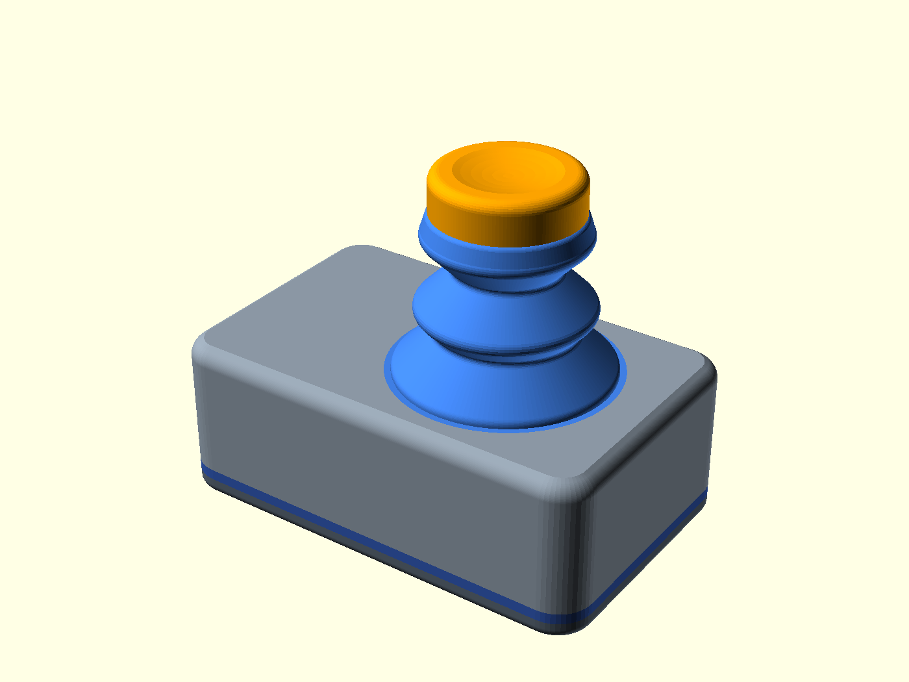

Коробка з кришкою 62.4 × 39.1 × 23 мм, із ковпачком ≈53 мм заввишки.

```
./render.sh     # усі STL + PNG + автоматичні перевірки у versions/vNNN-.../
```

Далі: **[PRINTING.md](PRINTING.md)** — друк, збирання, лиття силіконом ·
**[MODEL.md](MODEL.md)** — як воно влаштовано і які параметри крутити.

---

## Що всередині

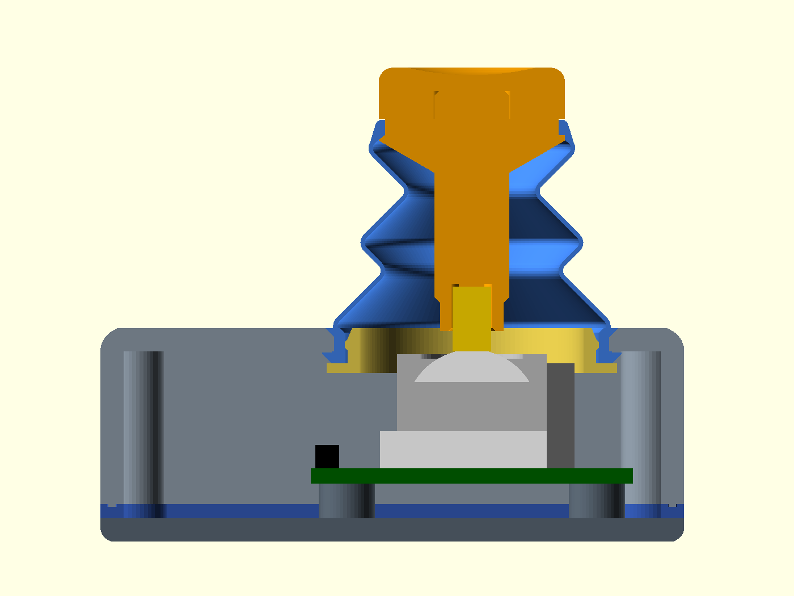

Плата прикручена до стійок **нижньої** кришки — кришка з платою заводиться в
коробку знизу, тож зверху немає жодного гвинта і жодного стику. Між бортиком
коробки і кришкою — плоска TPU-прокладка. Сильфон сидить у панелі громметом,
угорі затиснутий на канавці штока ковпачка.

Три стики, три різні рішення:

| Стик | Чим тримається |
|---|---|
| сильфон ↔ ковпачок | валик Ø1.6 натягується на канавку штока з натягом 6 %, зверху його накриває приклеєна головка |
| сильфон ↔ коробка | конус громмета сідає в зенківку панелі **врівень** з нею, губа тисне знизу, жорстке кільце зсередини не дає громмету стягнутися |
| коробка ↔ кришка | ребро 0.8 × 0.5 на бортику коробки вдавлюється в канавку прокладки; навколо кожного гвинта ребро перерване, там прокладка суцільна |

Ось той самий громмет зблизька — ліворуч гофра, знизу жовтим розпірне кільце,
праворуч стінка коробки:

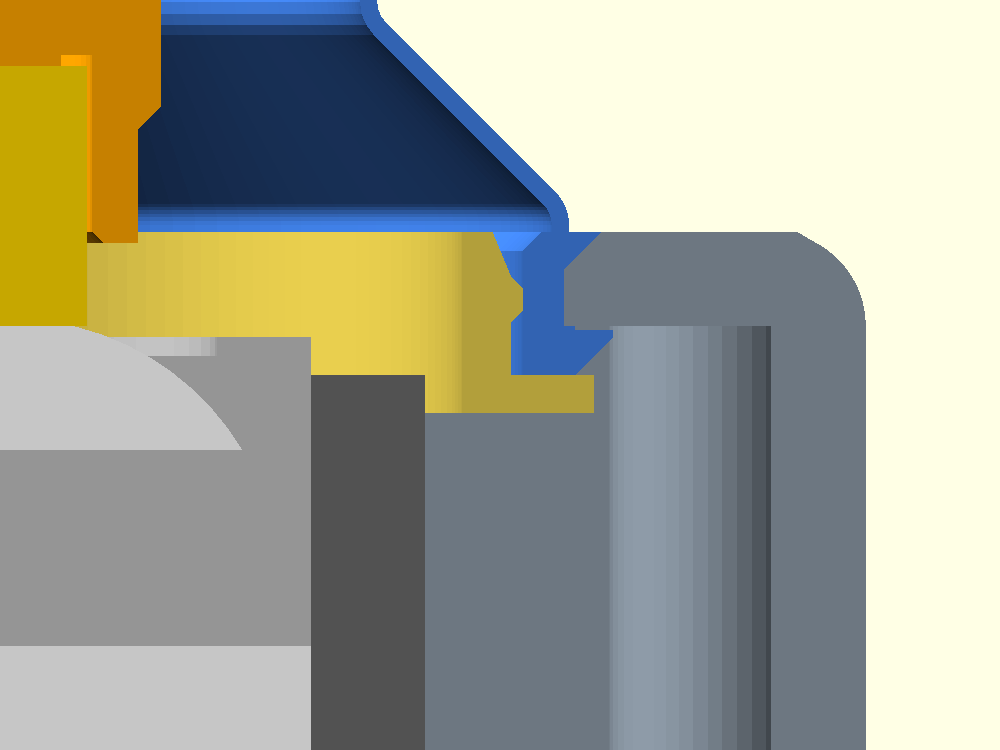

Над панеллю не виступає нічого, за що можна зачепитися.

## Чому воно повертається в центр

Сильфон надрукований у тій самій формі, яку має після встановлення, тому єдина
його рівновага — центр. Пружина не потрібна.

Уся хитрість у тому, щоб зробити його достатньо м'яким. Стінка друкується в
**один прохід сопла** — 0.46 мм, тонше фізично не буває, а жорсткість росте як
куб товщини. Решту віддає геометрія складок: жорсткість складки ∝ 1/глибина³,
тож одна глибока складка м'якша за кілька дрібних.

| `bellows = "v019"` — дві складки | `bellows = "deep"` — одна глибока |
|---|---|
| 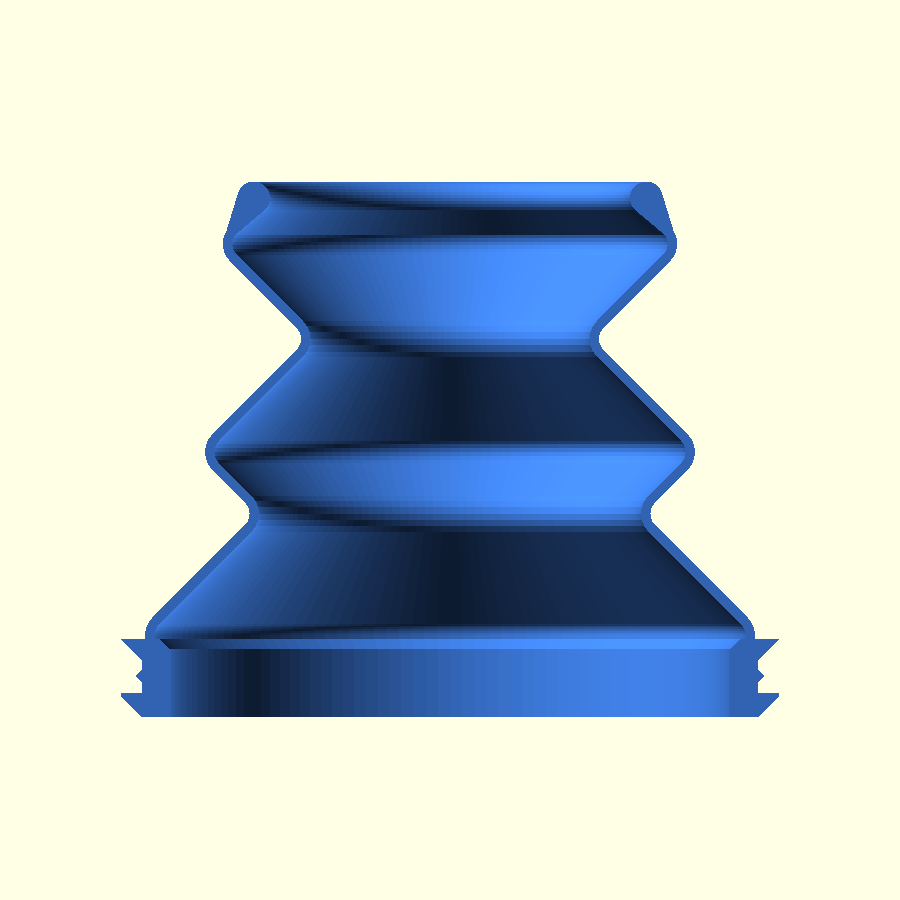 | 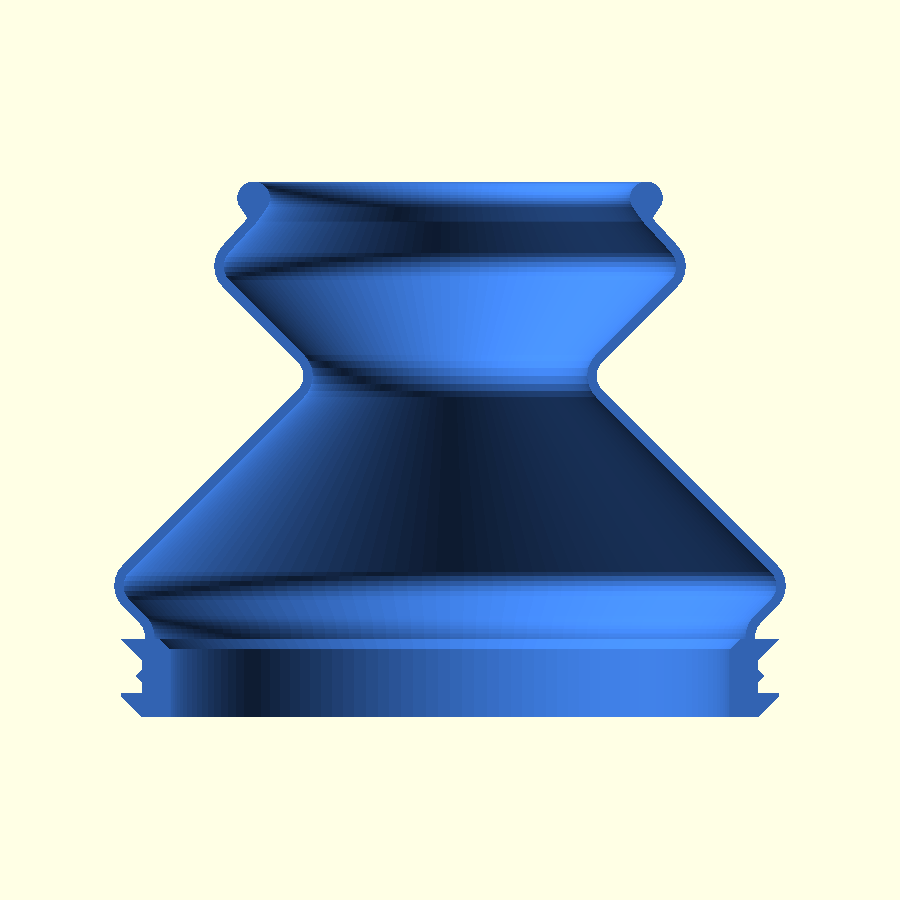 |
| індекс піддатливості 0.46 · надруковано і перевірено на модулі | індекс 0.91 — удвічі м'якша на папері, ще не друкована |

Обидві стають на той самий громмет, те саме кільце і ту саму канавку штока —
можна надрукувати обидві й порівняти на одному модулі.

Модель рахує це сама і друкує в `ECHO` при кожному рендері:

```
ECHO: "Bellows "v019": meridian 27.9676 mm, rest chord 21.4529, last leg 33.4078 deg
       from vertical (keep <= 50), … compliance index 0.461043 (x 1/wall^3, higher = softer)"
ECHO: "At 25 deg: bead shifts 13.08 mm, … far-side stretch 3.95858 % (no stretch up to 21 deg)"
```

До 21° нахилу далекий бік сильфона тільки згинається; розтяг починається пізніше
і на 25° становить ~4 %. Саме тому валик кріпиться вгорі штока, а не внизу, де
хід удвічі менший: 13 мм довжини стінки коштували б 32 % розтягу замість 4, а
розтяг — це вже не згин, а жорсткість.

## Сім деталей

| | | |
|---|---|---|
| 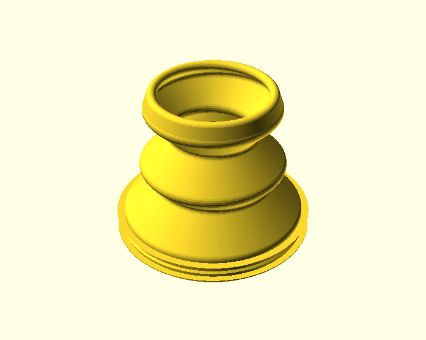 **Сильфон з громметом** — TPU, стінка в один прохід | 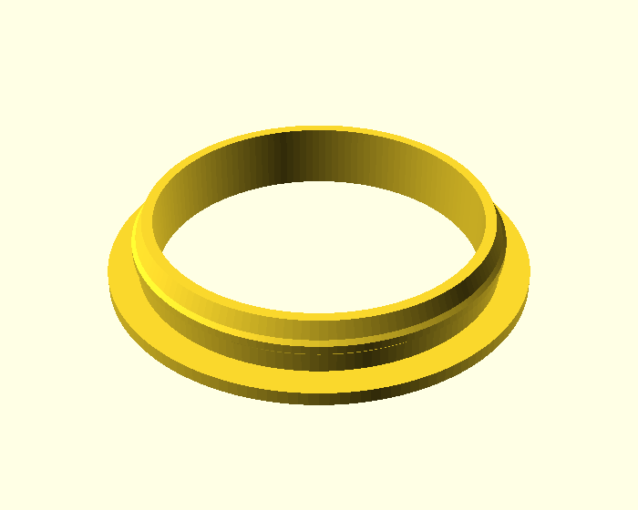 **Розпірне кільце** — вставляється в громмет зсередини | 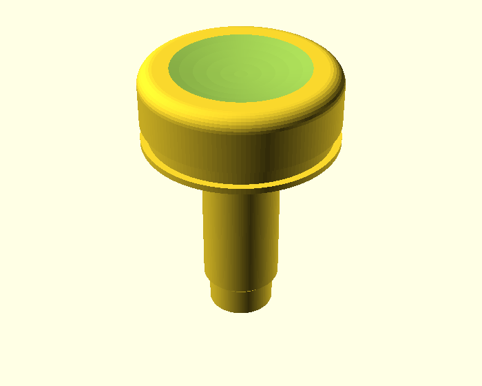 **Ковпачок** — головка + шток, склеюються |
| 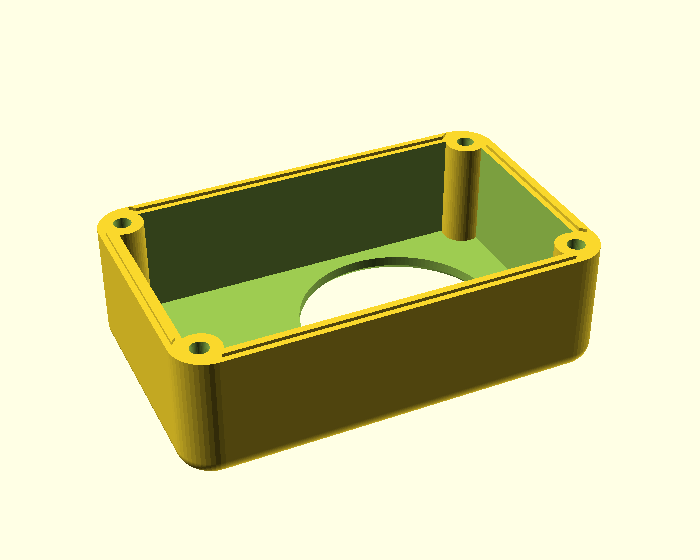 **Коробка** — ребро ущільнення на бортику, 4 бобишки | 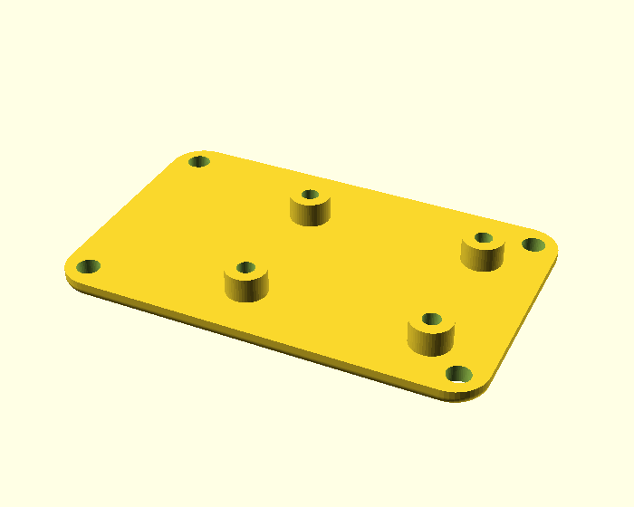 **Кришка** — стійки під плату, заходить знизу | 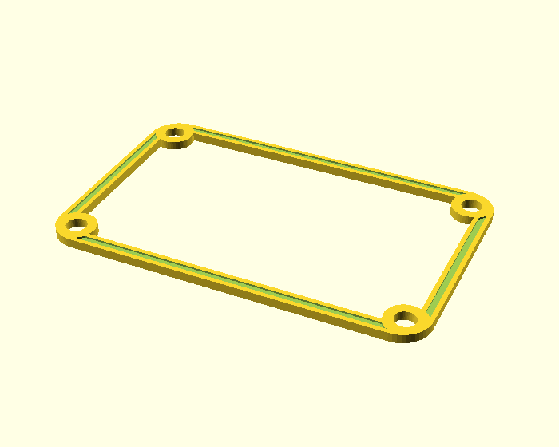 **Прокладка** — TPU, канавка під ребро |

Плюс макет плати — не для друку, щоб звірити на екрані положення джойстика й
отворів зі своїм модулем:

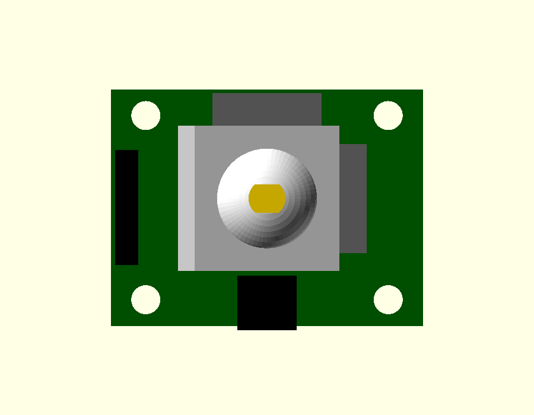

## Силікон замість TPU

Друкований сильфон упирається в мінімальну стінку 0.46 мм. Силікон обходить це
матеріалом: A20 приблизно в 50 разів м'якший за TPU 95A, тож навіть стінка
1.2 мм дає ~втричі м'якший сильфон. Геометрія лишається та сама.

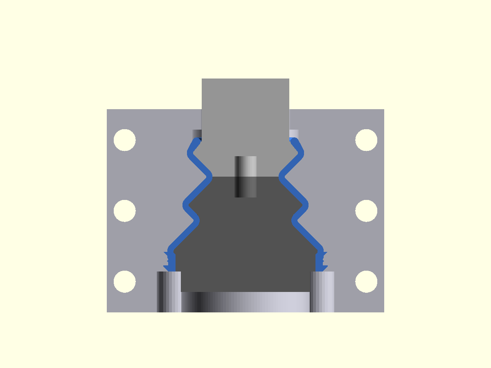

Молд друкується з тієї ж моделі: дві **однакові** половини мушлі (усе на площині
розняття стоїть парами ±X, тож одна, повернута на 180°, і є друга), стрижень,
розрізаний по талії гофри — суцільним його не вийняти, бо це бочка між двох
вужчих отворів, — і штифти. Ллється знизу вгору шприцом: гравітацією кільцеву
щілину 1.2 мм на 28 мм висоти не залити.

Порядок і кількість силіконом — у [PRINTING.md](PRINTING.md). Молд поки що
рахований і перевірений булевими тестами, але не друкований.

## Як це росло

Однакова камера, сорси з `versions/` — там лежить копія `.scad` кожного рендера.

| v001 | v005 | v006 |
|---|---|---|
| 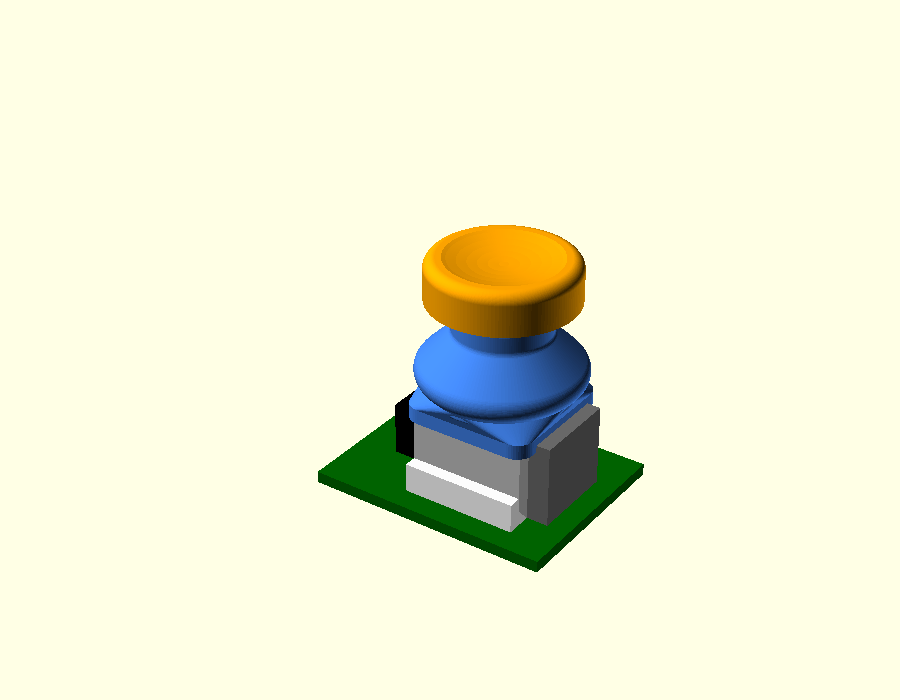 | 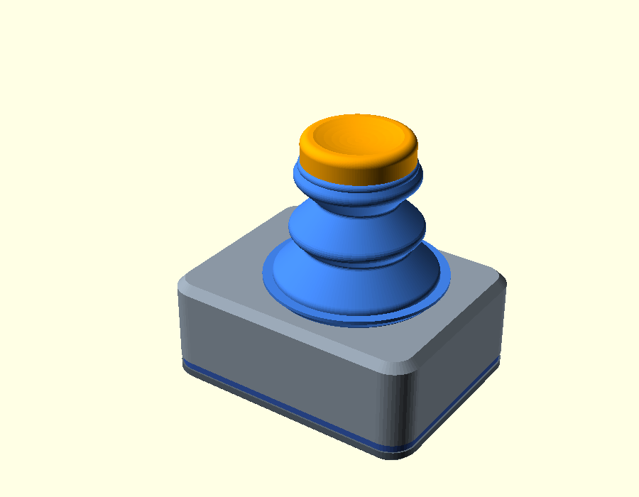 |  |
| Просто відкритий пильник на рамку джойстика. Коробки ще немає, герметичності теж. | Громмет у панелі замість затиснутого листа, кришка перенесена вниз — гвинтів зверху вже немає. | **Надруковано.** Конус громмета сідає в зенківку врівень із панеллю, з'явилось розпірне кільце і заокруглені ребра. |

| v019 | зараз |
|---|---|
|  | 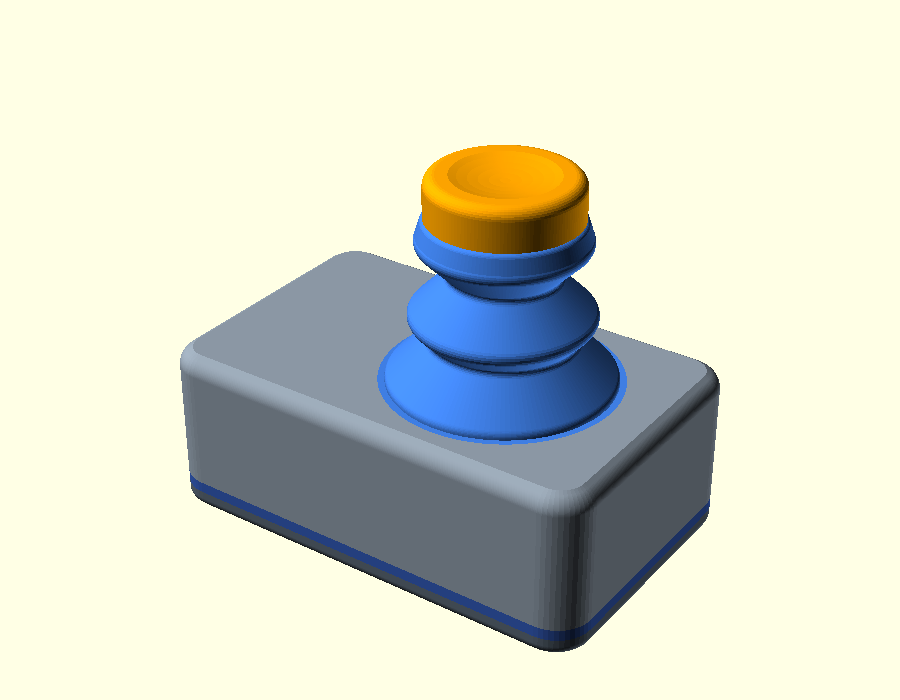 |
| **Надруковано.** Виміряне положення джойстика на платі, ковпачок із двох частин, валик перенесений на фланець штока. | Дві гофри на вибір, молд під лиття, перевірка сітки на кожному рендері. |

Повна історія з причинами — наприкінці [MODEL.md](MODEL.md).

## Чим це перевіряється

Рендер, який виглядає правильно на PNG, нічого не доводить. Тому кожен `./render.sh`
закінчується перевірками, і ще три запускаються руками:

| | |
|---|---|
| `check_mesh.py` | кожен STL має бути **одним замкненим тілом**: ребро рівно у двох трикутниках, тіло одне |
| `check_overhang.py` | ріже профіль шарами по 0.1 мм: острови, нависання > 45°, перерізи тонші за лінію слайсера |
| `check_fit.scad` | сім булевих тестів молда — кожен експортує те, чого не має існувати; лишитись має ~0 мм³ |
| `stl_volume.py` | об'єм, площа і середня товщина 2·V/A — для залишку, що мав бути нулем, значення має товщина, а не об'єм |
| `compare_versions.sh` | порівнює STL двох рендерів побайтово: деталь, якої не торкались, мусить лишитись байт-у-байт |

Це не формальність. Два приклади, через які ці перевірки й з'явились:

- **v021.** Стінку сильфона зробили в один прохід 0.40 мм. Слайсер мовчки
  викидав її на згинах, де переріз стає вертикальним, і в деталі з'являлись
  порожні шари. Лікується тим, що стінка одного проходу моделюється як ширина
  лінії слайсера + 0.04 = 0.46 — і перевіркою `minw` у `check_overhang.py`.
- **v026.** Мушля молда не різалась, слайсер лаявся на non-manifold edges.
  Причина: спільну внутрішню поверхню деталі й стрижня малює різний код —
  стінку 24-кутниками, стрижень справжніми дугами `offset()`, — і на радіусах
  складок вони розходились на ~5 мкм. Ці щілини защемлювались у порожнині й
  лишали в мушлі вільні кільця товщиною 5 мкм. На PNG не видно, в об'ємі не
  видно. Звідси `check_mesh.py` на кожен рендер.

А `compare_versions.sh` — єдиний чесний спосіб відрізнити «переписав код» від
«зрушив геометрію»: ні PNG, ні кількість трикутників цього не дають.

## Статус, чесно

- **Надруковано і зібрано:** `v006` і `v019`. Гофра за замовчуванням — та сама,
  що стоїть на реальному модулі.
- **Не перевірено в пластику:** глибока гофра `deep`, молд під силікон.
- **Не виміряно:** крок монтажних отворів плати. Сітки KY-023 немає в
  datasheet-ах, а спільнотний макет суперечить сам собі (текст 26.7 × 20.3, STL
  26.5 × 19.0). У моделі стоїть 26.7 × 20.3 — для стійок M3 промах в 1 мм уже
  критичний, тож **зміряй свою плату перед першим друком**. Це два параметри.
- IP68 тут означає конструкцію під IP68, а не сертифікат: занурення ніхто не
  міряв манометром.

## Потрібно

OpenSCAD 2021+ (бекенд Manifold), Python 3 для перевірок, принтер із соплом 0.4
і столом від 70 × 50 мм. Пластики: TPU на сильфон і прокладку, PETG/ASA на
коробку й кришку, PLA/PETG на кільце й ковпачок. Кріплення — 4 × M3×6 і
4 × M3×10.

Повний список, налаштування слайсера, порядок збирання і лиття силіконом —
[PRINTING.md](PRINTING.md).

## Ліцензія

MIT — [LICENSE](LICENSE). Друкуй, міряй свою плату, міняй параметри, продавай
надруковане; єдина умова — зберегти рядок копірайту. Гарантій жодних: див.
«Статус, чесно» вище.
